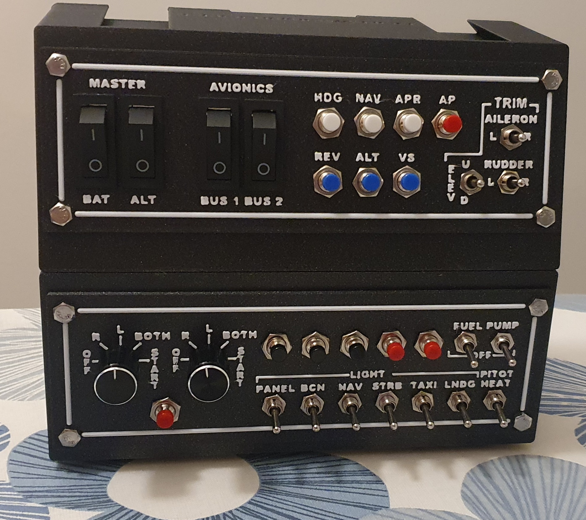
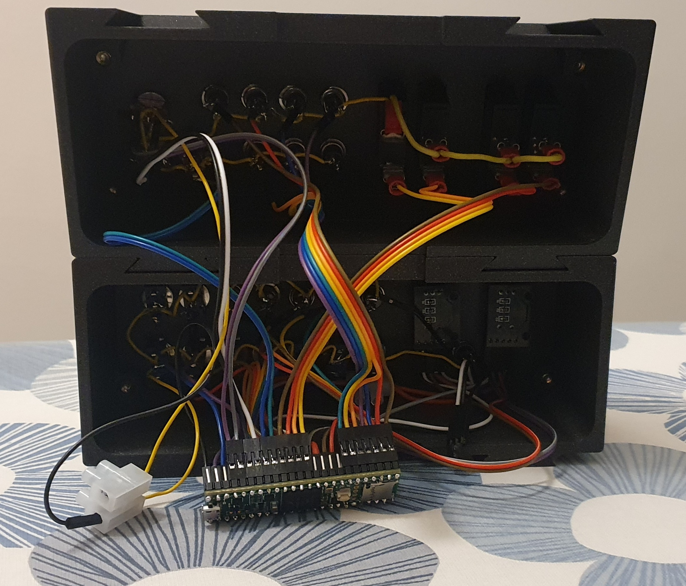
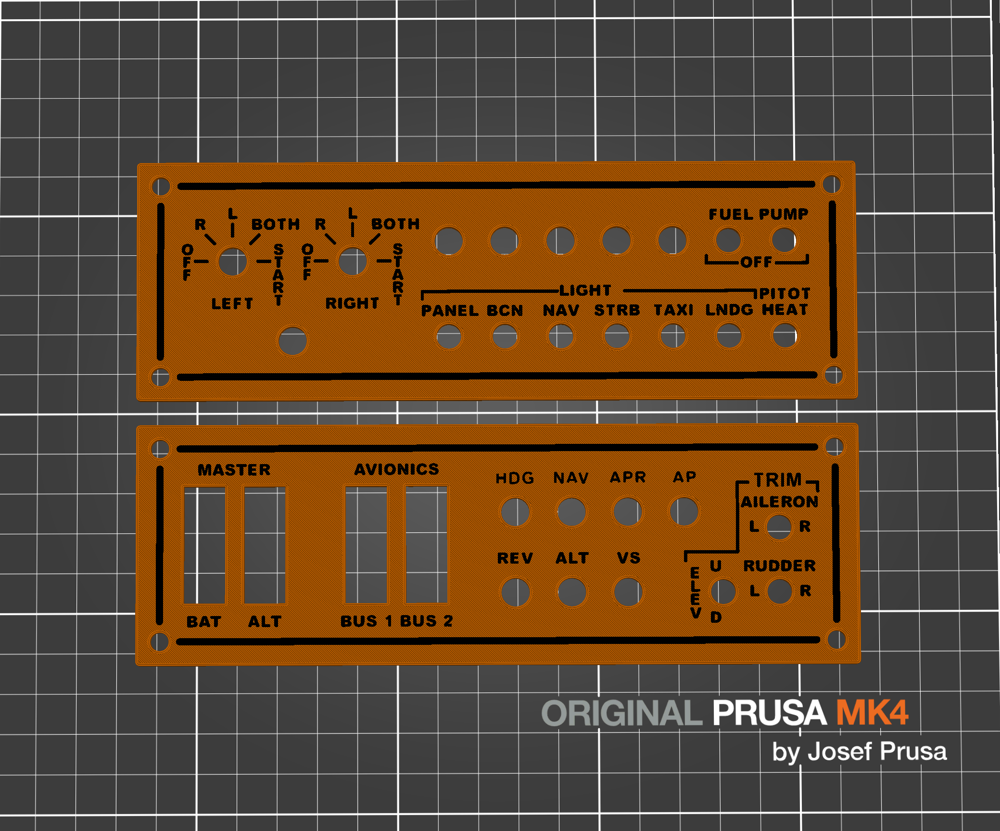

# Flight Sim Panel V2
A rework of the [Flight Sim Panel V2](https://forums.flightsimulator.com/t/3d-printed-flight-simulator-panel-v2/219057) by [Aaron Cobb](https://www.cobbinnovation.com/).

I have modified some of the 3D models, and refactored the code. Here's what the finished product looks like.

# Source code refactor
The main point of the refactor was to make it easier to have different pin layouts than the original, to make it more flexible. Note however, that this is of course at your own risk. It is up to you to make sure you do not reuse pins, or cause short-circuits or in any way harm the equipment.

The configuration has been migrated to variables, where the pin numbers and joystick bindings are set in a single place. To change the pin layout, or the joystick mapping for that matter, you therefore only need to change the code in a single place.

# 3D models
I only provide the 3D models that I have modified. There are a lot more available from Aaron Cobb in the previously linked forum post. I have recreated two enclosures to fit threaded inserts for mounting the panels. For each enclosure, you will need a panel. These are found among those 3D models by Aaron Cobb. The exception is the `PNL-MSTR-Auto-Trim` which I have recreated since the button holes were the incorrect size (3,05mm radius instead of 3,5mm like the rest). This version has the correct size button holes, so the buttons fit without having to drill them. This project as seen in the images was created with two stacked enclosures (0deg bottom, 15deg top) with the `PNL-MSTR-Auto-Trim` top panel and `PNL-Mags-Lights-Fuel-Xtra` bottom panel in mind. However, you are free to create any setup you want, although you might need to modify the code and/or 3D models in that case.

The modular enclosures have been modified to fit threaded inserts, to avoid any damage to the plastic parts caused by screwing directly into the printed part. Each enclosure uses 4 threaded inserts. I used the [M4x8,1 threaded inserts from CNCKitchen](https://cnckitchen.store/products/gewindeeinsatz-threaded-insert-m4-standard-50-stk-pcs). The hole for the insert is 5,6mm in diameter, in line with the specifications for that specific threaded insert, should you find other alternatives that work with the same hole diameter.

I have provided Autodesk Fusion 360 project files for all models I have created so you can easily modify them to your need, under the terms of the license. I also recreated the blank panel, should you want to more easily create your own panels in Fusion 360 without having to work with the blank STL file.

# Thoughts and recommendations
After building this project, I have a few recommendations to make. Firstly, by far the most tedious and delicate part was soldering wires to the components and the Teensy. The margins are pretty small, and making sure all solder points give good connections without any accidental solder bridges, in combination with the cable strain causing solders to break made it an annoying process. Especially since the components are not made for direct wire soldering, and all look different. At that point, I decided to switch strategy and bought a kit for JST and Dupont connectors, which I had considered from the start but decided to try soldering first. JST connectors are superior, but unfortunately my XH-xA connectors had protrusions on the sides, meaning I could not put multiple connectors next to each other. Therefore, I opted for the Dupont connectors which are completely flush. Crimping the connectors was a bit tedious, but the connections were much easier to handle and more reliable, and allowed me to group them logically with regards to the components. If I would do this again, I would definately use Dupont connectors from the start, and also put in the extra time to crimp connectors for the component side as well, although the components do have different connector types which is rather annoying.

Also, I definately recommend printing the panels with a different color for the text, as it was hard to read on the single filament panels I printed in the beginning. In the end, I printed new multi material panels and transferred all components to them. I do not have multiple extruders, or a multi material unit for my printer, but printing multi material manually is easy with just a single filament change as in this case. I have provided the GCode for my Prusa MK4 for multi material (black and white Prusament PLA) with a single extruder, that prints the two mentioned panels with a manual filament change for the text. Should you have a different printer, filaments, or a multi material unit, you can as mentioned get the panels from Aaron Cobb and slice them yourself. This is a picture of the provided panels in single extruder multi material mode:

Finally, I would use longer wires as short wires cause more strain and limit the positioning of the Teensy. I used longer wires for the top panel, but the shorter wires for the bottom panel were slightly too short meaning the Teensy was pretty difficult to position well. I designed a holder for the Teensy, but as it is already rather cramped inside the enclosures, and my wires were too short, I did not include it here or implement it in the design.

# Component list

Aaron Cobb also provided a component list in the linked forum post, however I am based in Europe and could therefore not find exactly the same components. Should you also face the same issue, I have also included the mounting hole sizes so you can find alternatives.

## Teensy microcontroller

* 1x [Teensy 4.1](https://www.amazon.se/dp/B08CXTSJV6)
* 2x [Male Pin Header](https://www.amazon.se/dp/B07DBY753C), more than 2 included in this kit

## Panel mounting to enclosure

Note that this is optional, but recommended. Alternatively you could use screws directly into the plastic, but this will of course damage the plastic and may cause them to come loose if you reuse the screw holes multiple times (for example when removing and putting the panel back on). Therefore, using threaded inserts is my recommendation which also provide better rigidity in the mounting.

* 4x per enclosure (8 total for this configuration) [5,6mm diameter M4 threaded inserts](https://cnckitchen.store/products/gewindeeinsatz-threaded-insert-m4-standard-50-stk-pcs)
* 4x per enclosure (8 total for this configuration) M4 machine screws

## MSTR Auto Trim panel

* 4x [Rocker Switches](https://www.amazon.se/dp/B00WJLF8OQ), mount hole size 10,2 x 29mm
* 7x [Momentary Push Buttons](https://www.amazon.se/dp/B07XRKN3F3), mount hole diameter 7mm
* 3x [Momentary Mini Toggle Switches](https://www.amazon.se/dp/B01M0LXR0L), mount hole diameter 6mm

## Mags Lights Fuel Xtra panel

* 2x [KY-040 Rotary Encoders](https://www.amazon.se/dp/B0D12N311C), mount hole size 7mm
* 6x [Momentary Push Buttons](https://www.amazon.se/dp/B07XRKN3F3), mount hole diameter 7mm
* 9x [Mini Toggle Switches](https://www.amazon.se/dp/B0B56S4F1X), mount hole diameter 6mm

# License
This work is shared under the same license as the original work, CC BY-NC-SA 4.0, in line with the license terms.